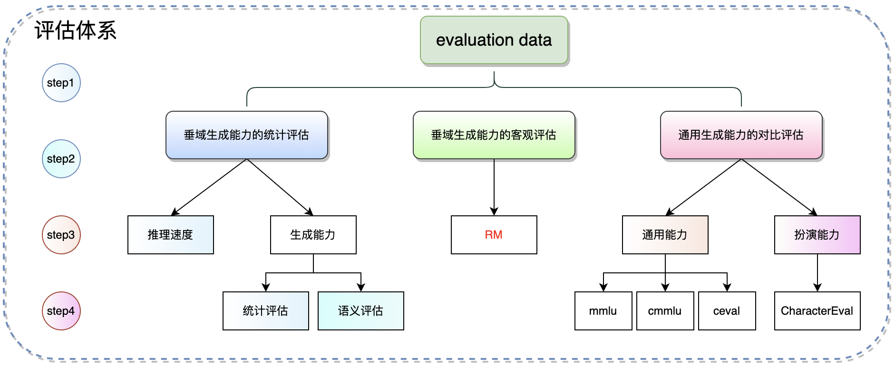

# llm_evaluation




# Run

```shell
pip install -r requirements.txt
```

下载`【语义评估】`所需模型：

```shell
huggingface-cli download --resume-download thenlper/gte-large-zh --local-dir /home/wangguisen/models/gte-large-zh
```

下载`【扮演能力】`所需模型：

```shell
huggingface-cli download --resume-download morecry/BaichuanCharRM --local-dir /home/wangguisen/models/BaichuanCharRM
```

run step1:

```shell
CUDA_VISIBLE_DEVICES=2,3 python main.py "step1" "./yamls/step1.yaml"
```

run step2:

```shell
CUDA_VISIBLE_DEVICES=2,3 python main.py "step2" "./yamls/step2.yaml"
```

run step3:

```shell
CUDA_VISIBLE_DEVICES=2,3 python main.py "step3" "./yamls/step3.yaml"
```

run step4:

```shell
CUDA_VISIBLE_DEVICES=2,3 python main.py "step4" "./yamls/step4.yaml"
```


# 结果目录

```shell
./output
├── ceval
│   ├── results.json
│   └── results.log
├── CharacterEval
│   ├── step1_generation.jsonl
│   ├── step2_generation_trans.jsonl
│   ├── step3_evaluation.jsonl
│   └── step4_eval_scores.jsonl
├── cmmlu
│   ├── results.json
│   └── results.log
├── mmlu
│   ├── results.json
│   └── results.log
├── all_results.json
├── generated_predictions.jsonl
└── predict_results.json

4 directories, 13 files
```


# Result

| model | rouge-1 | rouge-2 | rouge-l | samples_per_second | steps_per_second | sem_sim_score | avg_mmlu | avg_cmmlu | avg_ceval |      |      |
| ----- | ------- | ------- | ------- | ------------------ | ---------------- | ------------- | -------- | --------- | --------- | ---- | ---- |
|       |         |         |         |                    |                  |               |          |           |           |      |      |
|       |         |         |         |                    |                  |               |          |           |           |      |      |
|       |         |         |         |                    |                  |               |          |           |           |      |      |


# Train RM

$$
loss_1 = - \frac{1}{C_N^2 + 1} E_{(x, n_a, n_b) \sim N} [log(σ( r_{\theta}(x, n_a) - r_{\theta}(x, n_b) ))]
$$

$$
loss_2 = \frac{1}{T} \sum_{i=1}^{T} \sum_{n \in N} (F(S_n, W_n) - \hat{S_n})^2
$$


# TODO

- [x] 与 llama factory 解耦。
- [ ] rouge解耦，增加f、p、r。
- [ ] 奖励模型训练。
- [ ] vllm推理。
- [x] 支持多卡推理。
- [ ] 流式写入结果。
- [x] 支持Lora。
- [ ] step2输出语义分值分布。

